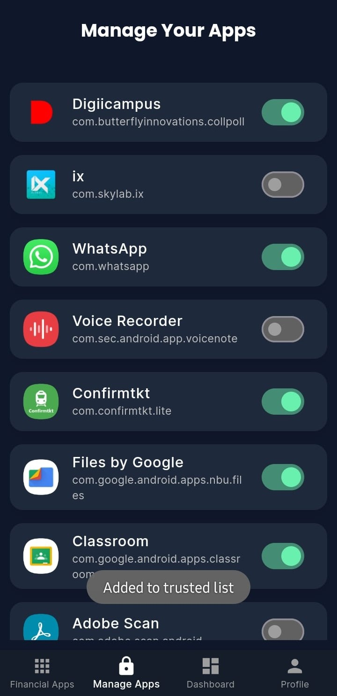
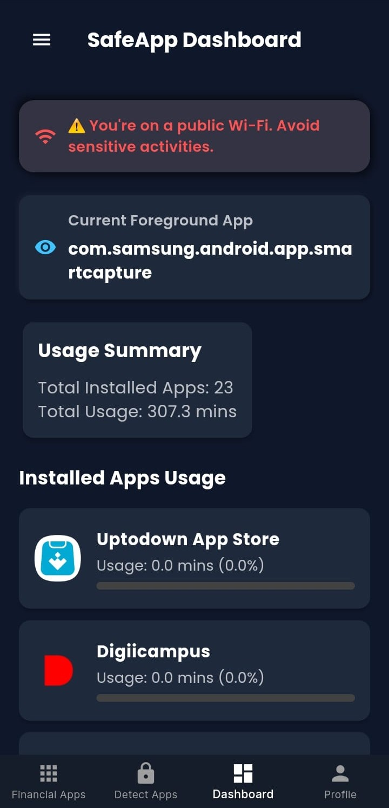

# SafeApp

<p align="center">
  
</p>


# 🔐 SafeApp - Secure Financial Environment on Mobile

SafeApp is a next-generation security solution designed to **create a secure containerized environment** where only trusted and verified financial apps (approved by Google/Apple and regulators) can be installed, accessed, and used.

>🛡️ Developed for Innovision Hackathon 2025 – built with Flutter, Android native APIs (AccessibilityService & Device Admin), and secure app lifecycle control.

---


<p align="center">
  
  
 
 
 
 


</p>


## 🚀 Features

✅ **Containerized App Environment**  
- Only whitelisted financial apps (e.g. Google Pay, PhonePe, Paytm) are allowed to be added.  
- Any app not installed from the official Play Store or not in the trusted list is blocked.

✅ **Real-Time App Monitoring**  
- Blocks and closes unauthorized financial apps when opened – even from background.

✅ **OTP Protection**  
- Prevents untrusted apps from accessing sensitive OTPs/messages.

✅ **Install Source Validation**  
- Verifies whether an app is downloaded from the official Play Store.

✅ **Device Admin Restrictions**  
- Prevents the installation of unknown apps from external sources.
- Enhances device policy enforcement to safeguard user data.

---

## 🧑‍💻 Tech Stack

| Layer         | Tech Used                          |
|---------------|------------------------------------|
| Frontend      | Flutter (Dart)                     |
| Platform APIs | Android AccessibilityService, DeviceAdmin |
| State Mgmt    | Secure Storage and SharedPreferences (Flutter)        |
| Native Code   | Kotlin (Platform Channels)         |

---

## 📲 How It Works

1. User launches SafeApp and selects apps from a verified financial list.
2. Only apps from the **Play Store** and on the **approved list** can be added to the secure zone.
3. **Accessibility Service** monitors running apps – if an unapproved financial app is launched, it is immediately blocked.
4. **Device Admin Service** prevents installation from unknown sources.

---

## 🛠️ Setup Instructions

🔗 Backend Repository
➡️ https://github.com/WannaCry016/safeapp-dashboard/tree/kt

🔗 Dashboard Repository
➡️ https://github.com/WannaCry016/safeapp-frontend

 **Requirements:**  
> - Flutter SDK (`>=3.19.0`)  
> - Android Studio / VS Code  
> - Android device or emulator (API 30+)

1. **Clone the Repository**
   ```
   git clone https://github.com/0kt1/safe-app.git
   cd safe-app
   ```
2. **Install Dependencies**
    ```
    flutter pub get
    ```
3. **Enable Accessibility Service**
    Go to your device Settings > Accessibility > SafeApp Accessibility Service and turn it ON.

3. **Enable Device Admin**

    SafeApp will prompt you to enable Device Admin on first launch. Accept it for full functionality.

4. **Run the App**
    ```
    flutter run
    ```
🔒 Permissions Required
Permission	Purpose
Accessibility Service	Monitor and block untrusted apps in real-time
Device Admin	Enforce restrictions and disable unknown source installs
Usage Stats	Track running apps in background
Package Info	Identify installation sources and verify app legitimacy

👥 Team – INVICTUS


